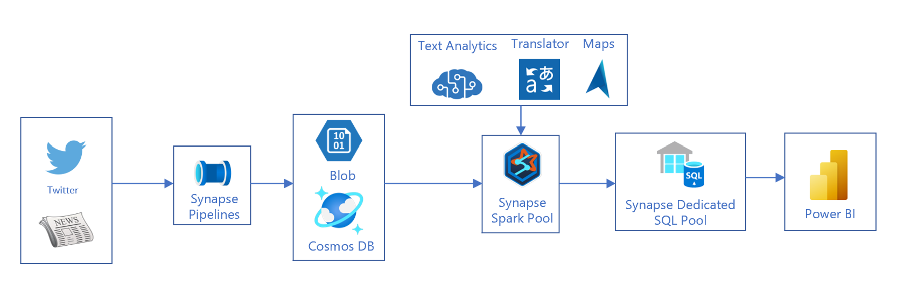
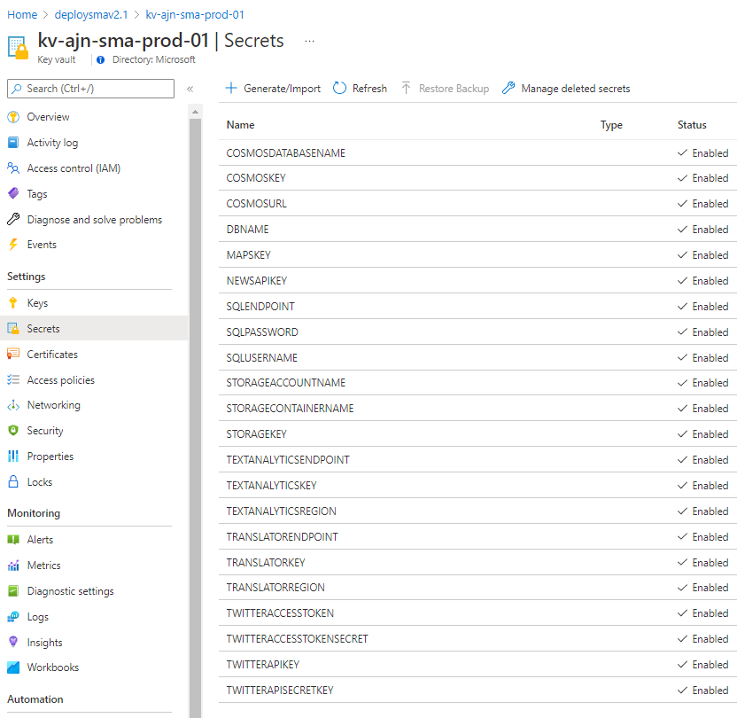
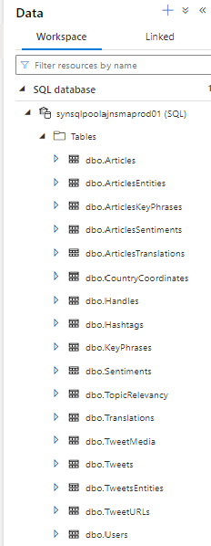

 
# Social Media Analytics Accelerator 

# Introduction

In today's society, the use of social media has become a necessary daily
activity. For companies and organizations around the world, monitoring
social media has become mandatory. It is an essential tool for
innovation and marketing. Its benefits range from the ability to get
instant feedback on products and services, allowing better relations
with end users and customers, provide a means to increase user
satisfaction very quickly, and keep up with the competition by detecting
and exploiting opportunities that the competitors may be missing.

The Social Media Accelerator provides the skeleton for building a Social
Media monitoring platform that helps collect data from social media
sites and websites and evaluate that data to make business decisions.
This document gives an overview of the solution architecture and
provides all the necessary requirements and information to deploy the
solution, as well as ideas and scenarios for extending the solution.

# Architecture

The architecture of the Social Media Analytics accelerator is depicted
below. The accelerator uses the following components:

-   Data Sources: twitter and news/web articles

-   Azure Synapse Analytics

    -   Synapse Pipelines: provides orchestration and automation for the
        different jobs

    -   Synapse Spark Pool: is the engine to run the Python notebooks
        for querying data sources, transforming, enriching and storing
        the data

    -   Synapse SQL Pool: stores the data model

-   Text Analytics: helps identify entities (persons, locations,
    organizations and events) and key phrases in text. It also performs
    sentiment analysis on the text

-   Translator: provides the ability to analyze data sources in
    different languages and present the outcome in both Arabic and
    English

-   Maps: helps precisely categorize user locations

-   Power BI: a template is available to view the insights in multiple
    report pages

# Deployment

The deployment of the accelerator is fully automated using a set of
Bicep and PowerShell files. The following **requirements** must be in
place before running the deployment:

-   A machine with [Azure
    CLI](https://docs.microsoft.com/en-us/cli/azure/install-azure-cli)
    installed

-   A dedicated resource group for SMA must be created prior to the
    deployment

-   The deployment must be run using an account with the following
    privileges:

    -   is member of the tenant where the solution is deployed (not a
        guest user)

    -   has owner permission on the resource group where SMA is
        deployed, and has the rights to add role assignments

    -   Fill the parameter values for in the file
        *SMAv2Template.parameters.json*

        -   ***location***: the Azure location for the deployment, for
            example: *westeurope*

        -   ***subscriptionId***: the ID of the subscription where the
            solution will be deployed

        -   ***ResourceGroup***: The name of the resource group where
            the solution will be deployed

        -   ***keyVaultAdministratorUserId***: the ID of the user
            account that will manage the secrets and passwords in Key
            Vault. Typically, it will be the ID of the user deploying
            the solution. It can be retrieved using the command: *az ad
            signed-in-user show \| findstr objectId*

        -   ***company***: 3 letters identifying the organization, for
            example: *fbk*

        -   ***deploymentType***: poc, devtest, or prod

        -   ***myPublicIPAddress***: the public IP address of the
            machine running the deployment. This IP will be allowed
            through Synapse firewall to later create and populate tables
            in the SQL pool

        -   ***sparkNodeSize***: medium

        -   ***sqlAdministratorLogin***: SQL pool administrator

        -   ***sqlAdministratorLoginPassword***: SQL pool administrator
            password

        -   ***SynapseSku***: DW300C

        -   ***News API Key***: can be obtained in newsapi.org

        -   ***Twitter Keys***: can be obtained in Twitter developer
            website

            Once the requirements are in place, the **deployment
            scripts** can be used to deploy and configure the solution.

            

            First, start with executing the ***Deploy_SMA.bat***, which
            provisions all the Azure resources, and configures Key Vault
            with all the secrets and keys of the provisioned services.
            After completion, the resources in the resource group should
            look like the below:

            

            Also, the Key Vault resource will have all the secrets
            configured automatically:

            

            Then, execute the configure part of the automation by
            running ***PostDeploy_SMA.bat***, which is a wrapper that
            performs the following:

-   It creates the Python notebooks in Synapse workspace

-   It deploys the database tables, views and stored procedures in the
    SQL Pool

-   It configures the Spark Pool cluster with the required libraries

-   It creates the automation pipelines in Synapse Pipelines and the
    scheduling triggers

The result of this step should look like the following:

  ----------------------------------------------------------------------------------------------------------------
  Tables, schemas, stored procedures and table data   Notebooks, pipelines and triggers, ready for customization
  deployed to SQL Pool                                
  --------------------------------------------------- ------------------------------------------------------------
  

  ----------------------------------------------------------------------------------------------------------------

# Customization

The accelerator comes with the specific use case of Arab Cup, and is by
default using queries and search terms specific to this topic. It is
necessary to customize the accelerator with the right search terms to
meet with the use case in hand. The customization is performed at the
pipelines' level. The accelerator uses two data sources (Twitter, and
News Articles), thus there are two pipelines to customize:

**News Articles Pipeline:**

This pipeline is named "*News Orchestrator - Arab Cup 1*" and comes with
multiple activities, of which two *Notebook activities* (highlighted in
yellow), that need to be customized. Selecting each activity, and
checking the *Base parameters* under *Settings* shows the query being
executed. It is important to customize both the *query* being executed
and the *topic* properties of each activity. The *topic* is used to tag
the data collected so that it can later be used to group it in the
dashboard. If more queries are needed, the Notebook activity can be
cloned to add the query and linked to the pipeline workflow. No changes
are required to the rest of the activities (starting from the Cleanup
activity).

**Tweets Pipeline**

This pipeline is named "*Tweets Orchestrator - Arab Cup 1*" and comes
with multiple activities, of which four *Notebook activities*
(highlighted in yellow), that need to be customized. Similar to News
Articles, selecting each activity, and checking the *Base parameters*
under *Settings* shows the query being executed. It is important to
customize both the *query* being executed and the *topic* properties of
each activity. The *topic* is used to tag the data collected so that it
can later be used to group it in the dashboard. If more queries are
needed, the Notebook activity can be cloned to add the query and linked
to the pipeline workflow. No changes are required to the rest of the
activities (starting from the Cleanup activity).

**Pipeline Triggers**

After the queries have been added, the data collection can be started by
simply enabling the triggers

# Power BI Template

A Power BI template file is available to access the insights generated
from the solution, and consists of an executive dashboard, a Twitter
analysis page, and a News Articles page. When the Power BI template is
opened, it prompts for the data source which should be the Synapse
workspace Sql endpoint. The report uses Import mode and displays 1 month
of history. When publishing the report in powerbi.com, *Scheduled
refresh* has to be configured to update the data in the dashboard. Below
are screenshots of the dashboard.

**Executive Dashboard**

**Twitter Analysis**

**News Article Analysis**

# Solution Extension

The accelerator can be extended in various ways and using numerous
features that can be added to provide more functionality.

**Data sources**

The data sources can be extended to include more social media websites
like Facebook, Instagram, Tiktok... Using a combination of Azure
Eventhubs and Streaming APIs, ingestion of streaming data can be added.

CosmosDB is a component that allow great extensibility of the solution,
as any news feed can integrate with the solution by dumping the data in
the NoSQL database.

**Additional Features**

Many features can be included to provide even more insights to the end
users. Enabling near real-time ingestion using data streaming can unlock
capabilities such as taking fast actions based on events in social
media. Also, Cognitive Services can be leveraged to perform Opinion
Mining, for example tracking users' opinion on brand entities or any
event organization before and after the events. It is also possible to
use Graph technology to build an Influencer Network Detection system,
that will detect influencers and visualize influencer's network. It is
also possible to link the solution to external systems in order to
perform specific actions based on pre-defined events. Also integrating
the solution with a chatbot is another great way for users to access the
insights provided by the solution.

**Visualization**

To improve the navigation of the Power BI reports and the user
experience, while allowing users to browse historical data, can be
achieved by adding an Azure Analysis Services tabular model layer.

An example extension of the architecture is shown below:

